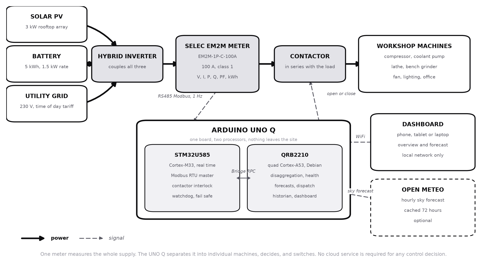

# ⚡ Udyog IQ

**Edge AI energy intelligence for small industry. One meter, one board, no cloud.**

Built for the **Arduino Physical AI Challenge India 2026** · Track: *Industrial and Sustainability AI*

---

## The idea in one paragraph

A small factory has a dozen machines, one electricity connection, and a bill
nobody understands. Metering every machine costs more than the electricity it
would save, so nobody does it. Udyog IQ puts **one** energy meter on the incoming
supply and an Arduino UNO Q next to it. From that single aggregate signal the
node works out, by itself and with no labelled training data, *which* machines
are running, *which one is starting to fail*, and *how much money is being burned
on idle*. Then it schedules solar, battery and grid against time of day tariffs
so the plant pays less.

Everything runs on the board. Nothing leaves the site.

## System



Power runs left to right along the top. The three sources meet at the inverter,
pass through the meter, pass through the contactor, and reach the machines. The
contactor really is in series there. The node sits underneath and touches the
power path at exactly two points: it reads the meter, and it commands the
contactor.

The circuit detail, including the isolation barrier that keeps mains potential
away from the board, is in [`docs/wiring.md`](docs/wiring.md) and
[`docs/diagrams/wiring_diagram.png`](docs/diagrams/wiring_diagram.png).

## Project status

| | |
|---|---|
| Software | complete and running end to end |
| Regression tests | 27, passing |
| Simulator | full synthetic workshop with solar, battery and injectable faults |
| Hardware | **not yet brought up.** Firmware is written and statically checked, not flashed |
| Measured results | **none yet.** See the note below |

The simulator was written to exercise the pipeline and it was genuinely useful
for finding faults. It cannot tell you how the system performs against real
machines on a real supply, so **no accuracy or savings figure is quoted anywhere
in this repository or the report**. Those numbers come from the proof of concept
bench described in the report, and not before.

Meter readings carry a `source` field through the whole system so that simulated
and measured data cannot be confused, in code rather than by memory.

## Why this needs an UNO Q specifically

The UNO Q has two brains on one board, and this project genuinely needs both.

| Brain | Runs | Why it has to be this one |
|---|---|---|
| **STM32U585** (Cortex-M33) | Modbus RTU master, contactor interlock, watchdog | RS485 has a turnaround deadline. The driver must release the line within a character time of the last stop bit or the reply collides with our own echo. Linux meets that deadline almost always, and *almost* means a corrupt frame every few minutes that looks exactly like a wiring fault. |
| **Qualcomm QRB2210** (quad Cortex-A53, Debian) | Disaggregation, health, forecasting, dispatch, historian, dashboard | scikit-learn, a SQLite historian, a 96 step optimisation recomputed every 15 minutes, and a web server. Not microcontroller work. |

The division also matters for safety. Minimum contactor dwell times and the
switching rate cap are enforced on the microcontroller, so they hold even when
the Linux side hangs, fills its disk, or is being updated.

One board replaces a PLC, a protocol gateway and an edge PC. An ESP32 cannot run
the learning half. A Raspberry Pi cannot promise the real time half.

## What it actually does

### 1. Discovers your machines from one meter
Every time a machine switches on or off it leaves a step in real and reactive
power. The node clusters those step signatures and recovers the individual
machines from the aggregate. **You do not need a meter per machine.**

### 2. Learns healthy behaviour without being told what healthy is
There is no labelled fault dataset for your specific lathe. So the node watches,
builds a baseline from each machine's own start events, and flags departures from
it using a linear autoencoder and an isolation forest, tracked as a health score
that trends over time.

### 3. Predicts tomorrow
- **Load**, by multi horizon gradient boosting, self supervised on the site's own history.
- **Solar**, from an Open-Meteo feed through a clear sky physics model with a learned residual correction that adapts to your roof's shading, tilt error and dust.

### 4. Decides when to use what, and acts on what it can
Dynamic programming over discretised battery state of charge, wrapped in a
receding horizon loop that recomputes the next 24 hours every 15 minutes:

```
minimise   time of day energy cost
         + maximum demand penalty
         + battery degradation cost
subject to load always served, state of charge and rate limits,
           critical loads never shed
```

Battery wear is priced explicitly, so the optimiser will not destroy a battery
chasing a small arbitrage. Sometimes the correct answer is to do nothing, and it
says so rather than cycling for the sake of looking busy.

**Read the next section before believing that paragraph.** Optimising something
you cannot actuate is not optimisation, it is a report, and this project is
careful about which is which.

### 5. Proves it worked
A shadow ledger runs the same day with no battery movement and no idle cutoff.
The difference is what the device contributed, measured rather than claimed, and
it is zero on days when there was nothing to gain.

## What the node controls, and what it only advises

This distinction matters more than any other in the project, so it is stated
before the features rather than buried in a limitations list.

| | Actuated? | How |
|---|---|---|
| **Loads** | **Yes** | A contactor in series with the machine supply, behind an interlock enforced on the microcontroller |
| **Sources**, grid against solar and battery | **Only if the inverter accepts external commands** | Modbus to the inverter, on the same RS485 pair as the meter |

**The node does not physically switch between grid and solar.** That transfer is
the inverter's job, and nearly every hybrid inverter already does it internally.
Building a source changeover into a project like this would be wrong on safety
grounds as well: an improvised switch between grid and inverter output risks
backfeeding a line somebody believes is dead, and a proper transfer switch is
mechanically interlocked so that both sources can never connect at once.

So the honest division is: **the inverter moves power between sources, and the
node moves loads.** Where the inverter exposes Modbus, the node also commands its
charge and discharge, and the dispatch plan above is enforced. Where it does not,
the plan is reported and labelled as advice, and the node goes on doing the thing
it can always do, which is deciding what runs and when.

That is not a consolation prize. Every scenario tested during development put
almost all of the available saving in demand charge shaving, which is a load side
action, and almost none in battery arbitrage, which the wear cost usually makes
uneconomic anyway.

## The dashboard

Three views, all served from the board, all usable on a phone.

- **Overview**: live power and energy flows, discovered machines with health, savings against the counterfactual, tariff position, decision log.
- **Forecast**: predicted load against expected solar with peak tariff bands behind it, the battery schedule with its state of charge trajectory, what the plan costs against doing nothing, per horizon predictions with empirical intervals, and the training state of every model.
- **Control**: an auto and manual switch. In **auto** the node runs its own policies. In **manual** every automatic policy is suspended, nothing switches on its own, and you operate the contactor and choose the source preference yourself. Switching mode never moves the contactor, and manual requests still pass through the interlock, because a person clicking quickly can chatter a contactor just as effectively as a bug can.

Views are hash routed, so `#/forecast` is linkable and survives a reload.

## Repository layout

```
app.yaml            App Lab manifest
python/main.py      entry point that runs on the Qualcomm side
sketch/             STM32 firmware, FQBN arduino:zephyr:unoq
udyogiq/
├── transport/      bridge | serial | sim, plus inverter adapters
├── meter/          Selec EM2M register map, decoding, sanity checks
├── pipeline/       ring buffer, features, change point detection
├── ml/             nilm · health · forecast · solar · battery
├── policy/         dispatch optimiser, receding horizon loop, decision engine
├── sustain/        tariff, weather, carbon and counterfactual accounting
├── store/          SQLite historian
├── api/            FastAPI and WebSocket server
└── runtime.py      orchestrator
web/                dashboard, overview and forecast views
sim/                synthetic workshop with solar, battery, injectable faults
tools/              probe_meter.py, build_diagram.py, build_report.js
tests/              27 regression tests
docs/               architecture, wiring, BOM, bring up, deployment, assumptions
```

## Running it without hardware

The whole system runs against the simulated plant, so you can develop and demo
before anything is wired.

```bash
pip install -r python/requirements.txt
python -m udyogiq.runtime --transport sim --warmup 4
```

`--warmup 4` replays four days of plant history at processor speed, taking about
forty seconds, so the node starts already knowing some machines instead of
looking empty. Then open `http://<this-machine>:8080` from a phone on the same
network.

## Running the tests

```bash
python -m pytest tests/ -q
```

Each test corresponds to a fault found by measurement rather than by reading the
code, which is the only reason to keep it.

## Bringing up real hardware

Read [`docs/bringup.md`](docs/bringup.md) first. The short version: prove the bus
from Linux before flashing anything.

```bash
python tools/probe_meter.py --port /dev/ttyUSB0 --scan
```

This sweeps baud rates and addresses, decides word order from physics that must
hold on any single phase supply, and prints readings to check against the meter's
own display. Eleven of the seventeen register offsets are inferred rather than
confirmed, and **a wrong offset does not raise an error, it returns a plausible
wrong number**, so this step is not optional.

Then write the values it prints into `config.local.json`, along with your actual
tariff, array geometry and battery cost. Until the tariff is right, every rupee
figure on the dashboard is arithmetic on a placeholder. See
[`docs/assumptions.md`](docs/assumptions.md).

## Deploying to the board

```bash
arduino-app run .
```

Full instructions, including a systemd unit and the transport choice, are in
[`docs/deploy.md`](docs/deploy.md). Bring it up on `serial` before `bridge`: that
removes the sketch from the loop, so if serial works and bridge does not, the
fault is firmware rather than wiring.

**Actuation ships disabled.** `policy.actuation_enabled` is `false`. Every
decision is logged with its reasoning in advisory mode precisely so you can judge
it before anything switches.

## Documentation

| Document | What it covers |
|---|---|
| [architecture.md](docs/architecture.md) | How the pieces fit, and why disaggregation must precede diagnosis |
| [wiring.md](docs/wiring.md) | RS485 connections, pin assignment, isolation, multi drop |
| [bom.md](docs/bom.md) | Bill of materials |
| [bringup.md](docs/bringup.md) | Ordered hardware bring up procedure |
| [deploy.md](docs/deploy.md) | Getting it onto the UNO Q and keeping it running |
| [assumptions.md](docs/assumptions.md) | Every site specific value and what it distorts if wrong |
| [Project report](docs/report/Udyog_IQ_Project_Report.docx) | The challenge submission document |

## Honest limitations

- At one sample per second this is **not** motor current signature analysis. That technique needs current sampled in the kilohertz. What is claimed here is trend and anomaly detection on aggregate electrical parameters: a real technique, and a different one.
- Disaggregation cannot see a small load hiding under a large running one. The detection threshold scales with local noise, so while a large motor runs, a small fan switching sits below the floor. That is structural, not a tuning failure.
- Machines that switch rarely take proportionally longer to discover, because a machine only becomes knowable once it has switched often enough to form a cluster.
- Two machines that always switch together will be reported as one. The dashboard shows uncertain clusters as unnamed candidates rather than asserting they are machines.
- Battery dispatch is advisory unless the inverter accepts external commands. The dashboard says which of the two it is, rather than offering a control that quietly does nothing.
- The node does not switch between grid and solar. That belongs to the inverter, for safety reasons as much as practical ones.
- The firmware has not been flashed. It is statically checked against the Python side, and that is not the same as working.

## Licence

MIT
